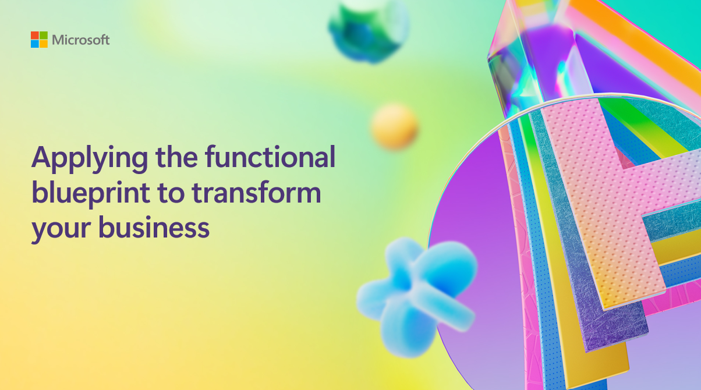

# Applying the functional blueprint to transform your business

## Session Description

Organizations using Copilot see boosts in productivity and creativity, but transforming this into enterprise-wide value can be challenging. Join us to explore Microsoft's analysis of 300 business processes across seven functions, which were used to build a blueprint to use today to enable AI-powered business transformation.

## Session Resources
You can find slides of the presentation here.

| Resources          | Links                             | Description        |
|:-------------------|:----------------------------------|:-------------------|
| BRK331 Spanish-language PPT Slides | [Link 1](https://aka.ms/AAsmf4p/) | Presentation deck in Spanish|
| BRK331 Portuguese-language PPT Slides | [Link 2](https://aka.ms/AAsltw8) | Presentation deck in Portuguese|

## Content Owners
Matt McKenzie, Director Product Marketing, Microsoft

