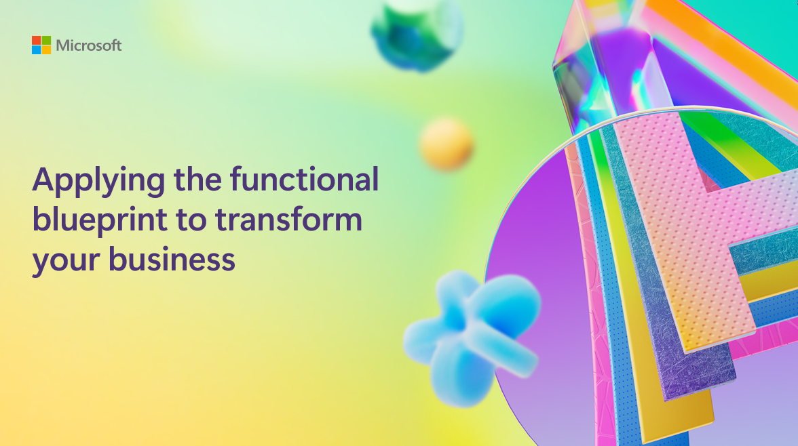

# BRK331: Applying the functional blueprint to transform your business

## Session Description

Organizations using Copilot see boosts in productivity and creativity, but transforming this into enterprise-wide value can be challenging. Join us to explore Microsoft's analysis of 300 business processes across seven functions, which were used to build a blueprint to use today to enable AI-powered business transformation.

## Session Resources
You can find slides of the presentation here.

| Resources          | Links                             | Description        |
|:-------------------|:----------------------------------|:-------------------|
| BRK331 English-language PPT Slides | [Link 1](https://aka.ms/AAsfvy6g/) | Presentation deck in English|

## Content Owners
Matt McKenzie, Director Product Marketing, Microsoft

